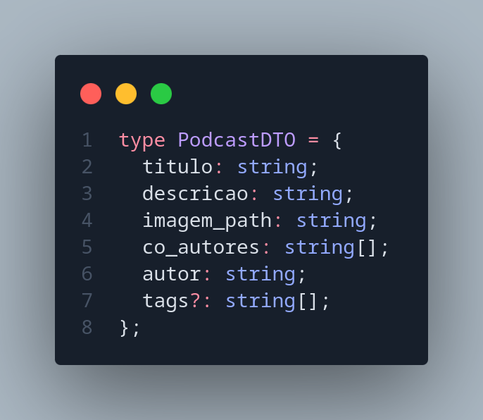

# 3.1. GoFs Criacionais

## Sumário
- [3.1. GoFs Criacionais](#31-gofs-criacionais)
  - [Sumário](#sumário)
  - [Metodologia](#metodologia)
  - [Diagrama antes e depois](#diagrama-antes-e-depois)
  - [Código](#código)
    - [Imagens do builder](#imagens-do-builder)
    - [Imagens do Factory](#imagens-do-factory)
  - [Código rodando](#código-rodando)
  - [Conclusão](#conclusão)
  - [Referências](#referências)
  - [Histórico de Versões](#histórico-de-versões)

---

## Metodologia

Com base nos artefatos previamente produzidos e nos requisitos levantados durante o planejamento da disciplina, foi realizada uma análise dos padrões de projeto GoF criacionais **([Ata de Reunião Nº](http://localhost/))**, com o objetivo de identificar sua aplicabilidade aos componentes da aplicação. Após essa avaliação, o grupo identificou os seguintes padrões e suas respectivas implementações:

- **Factory Method**: Utilizado no processo de registro de usuários, o padrão Factory Method foi adotado para permitir a criação flexível e extensível de diferentes tipos de contas. Essa abordagem facilita a adição de novos papéis ou perfis de usuário no futuro, promovendo um baixo acoplamento e alta coesão na lógica de criação. 
  - [**Implementação - Registrode Usuários**](https://github.com/UnBArqDsw2025-1-Turma01/2025.1-T01-_G7_FCTEPodcast/tree/main/fctepodcast-backend/src/factory/usuario)

- **Builder**: Aplicado na construção de objetos relacionados ao registro de podcasts e episódios, o padrão Builder foi escolhido para lidar com a complexidade da criação dessas entidades, que envolvem campos textuais, verificação de informações e campos de arquivos (Imagens e Áudio), os tornando classes difíceis de serem construidas. O uso desse padrão permite montar objetos passo a passo de maneira mais legível, modular e com menor risco de erros.
  - [**Implementação - PodcastBuilder**](https://github.com/UnBArqDsw2025-1-Turma01/2025.1-T01-_G7_FCTEPodcast/tree/main/fctepodcast-backend/src/builder/Episodio)
  - [**Implementação - EpisodioBuilder**](https://github.com/UnBArqDsw2025-1-Turma01/2025.1-T01-_G7_FCTEPodcast/blob/main/fctepodcast-backend/src/builder/Podcast/PodcastBuilder.ts)
 
- **Singleton**: O padrão Singleton foi empregado para garantir que determinadas classes essenciais da aplicação possuam apenas uma instância ativa durante toda a execução, assegurando consistência e economia de recursos. 
  - [**Implementação - Conexãoco com o Banco de Dados**](https://github.com/UnBArqDsw2025-1-Turma01/2025.1-T01-_G7_FCTEPodcast/tree/main/fctepodcast-backend/src/builder)
  - [**Implementaçao - Sistema de autenticação**](https://github.com/UnBArqDsw2025-1-Turma01/2025.1-T01-_G7_FCTEPodcast/blob/main/fctepodcast-frontend/src/context/auth/AuthContext.tsx)
  - [**Implementação - Sistema de reprodução de áudio**](https://github.com/UnBArqDsw2025-1-Turma01/2025.1-T01-_G7_FCTEPodcast/blob/main/fctepodcast-frontend/src/context/player/PlayerContext.tsx)

A partir dessa análise, os sistemas mencionados foram desenvolvidos seguindo os princípios desses padrões, adaptando suas estruturas às tecnologias utilizadas no projeto: **TypeScript, Express.js e React.js**.

## Diagrama antes e depois

## Código
### Imagens do builder

A classe apresentada na imagem acima implementa interface 'EpisodioBuilder' com a lógica específica para construção de um episódio. Ela garante que todos os campos necessários (título, descrição, audio_path, podcast_reference) sejam corretamente preenchidos, com validações claras e erros acessíveis, especialmente importantes em contexto de APIs com TypeScript e ExpressJS.

Em vez de construir objetos complexos com métodos de negócio, como em padrões tradicionais de domínio, adaptamos o padrão Builder (GoF - Criacional) para gerar DTOs simples, adequados ao uso com frameworks web como ExpressJS, onde os objetos são estruturados para transporte e validação de dados, e não para comportamentos complexos.

As validações lançam erros diretos com mensagens claras, pensando na usabilidade via HTTP/JSON — facilitando a comunicação com o cliente que consome a API.

A interface EpisodioBuilder define o contrato necessário para a construção de um episódio, permitindo a criação de diferentes implementações de construtores que sigam a mesma estrutura. Isso oferece flexibilidade e extensibilidade ao sistema, pois o código que consome o builder pode utilizar qualquer implementação sem precisar conhecer seus detalhes internos.

Esse design favorece a separação de responsabilidades e promove a reutilização de lógica de construção em diferentes contextos (por exemplo, criação via API, testes, importações externas etc.).

O EpisodioDTO é um Data Transfer Object, usado para transportar dados essenciais de um episódio — como título, descrição, caminho do áudio e referência ao podcast — entre diferentes camadas da aplicação. Ele representa uma estrutura simples, sem lógica de negócios, garantindo que os dados sejam consistentes, fáceis de manipular e prontos para serialização e desserialização em comunicações HTTP (como em APIs REST).

A classe ConcreteEpisodioBuilder é uma implementação concreta da interface EpisodioBuilder, responsável por construir objetos do tipo EpisodioDTO de maneira controlada e validada. Essa classe segue o padrão de projeto Builder, mas foi adaptada ao contexto do TypeScript e do ExpressJS, levando em consideração práticas comuns no desenvolvimento de APIs modernas.

O principal objetivo da ConcreteEpisodioBuilder é encapsular a lógica necessária para montar corretamente um objeto de episódio antes de expô-lo à aplicação. Para isso, ela garante que todos os campos obrigatórios estejam devidamente preenchidos, além de realizar validações específicas em cada etapa da construção. Dessa forma, evita-se que objetos inválidos sejam propagados para outras camadas do sistema.

Algumas adaptações importantes foram feitas para esse padrão funcionar bem com TypeScript e ExpressJS. Diferente da ideia clássica do padrão Builder, em que o “produto” é um objeto complexo com métodos e lógica própria, aqui o produto é um DTO (Data Transfer Object) — um objeto simples, sem lógica de negócios, que serve apenas para transportar dados entre camadas da aplicação, especialmente via API. Essa simplificação é ideal para aplicações web que trabalham com requisições e respostas em formato JSON, pois facilita a serialização e a comunicação com o cliente.

Além disso, as validações foram adaptadas para lançar erros com mensagens claras, facilitando o tratamento de erros em APIs. Isso é especialmente útil no contexto do ExpressJS, onde é importante que os retornos de erro sejam compreensíveis e bem formatados para quem consome a API.

A interface PodcastBuilder define a estrutura necessária para a construção de um objeto do tipo podcast. Ela atua como um contrato que estabelece os métodos que devem obrigatoriamente ser implementados por qualquer classe que deseje seguir o padrão de construção de podcasts no sistema.

A classe ConcretePodcastBuilder é uma implementação concreta da interface PodcastBuilder, sendo responsável por construir objetos do tipo PodcastDTO com base em validações e preenchimentos controlados dos dados. 

Foram feitas adaptações naturais para o contexto de TypeScript e ExpressJS, especialmente no uso de DTOs simples em vez de objetos mais complexos com métodos internos. Também foram aplicadas práticas de validação com mensagens claras, o que é crucial para aplicações web, onde os erros precisam ser compreensíveis para os consumidores da API. Garantir que mensagens sejam acessíveis e bem formatadas em JSON é essencial para a comunicação entre cliente e servidor.

O PodcastDTO é um objeto do tipo Data Transfer Object utilizado para representar um podcast de forma simples e direta. Sua principal função é transportar os dados relacionados a um podcast entre diferentes partes do sistema, como, por exemplo, entre um builder que constrói o objeto e um serviço ou controlador que realiza operações com ele.

PodcastDTO não possui métodos ou lógica interna. Sua estrutura é plana e voltada unicamente para o transporte de dados entre as camadas do sistema de forma segura, simples e eficiente.

### Imagens do Factory

A classe AlunoCreator é uma implementação concreta do padrão de projeto Factory Method, responsável por criar instâncias do tipo Aluno. Ela herda da classe abstrata UsuarioCreator e implementa o método factoryMethod com a lógica específica para a criação de um usuário do tipo aluno.

Essa abordagem permite que o sistema crie alunos sem precisar conhecer os detalhes da implementação, promovendo encapsulamento e flexibilidade na arquitetura.

Esse trecho de código mostra a criação de um registro de criadores de usuários. Ele funciona como um mapeamento entre tipos de usuários (como "PROFESSOR" e "ALUNO") e suas respectivas classes criadoras (ProfessorCreator, AlunoCreator), que são responsáveis por instanciar objetos do tipo usuário.

A ideia principal é permitir que o sistema consiga criar usuários diferentes sem precisar saber os detalhes da implementação de cada tipo.

A classe ProfessorCreator é uma implementação concreta do padrão de projeto Factory Method, responsável por criar usuários do tipo Professor. Essa classe estende a classe abstrata UsuarioCreator e implementa o método factoryMethod, encapsulando a lógica necessária para instanciar um professor com segurança.

Essa estrutura permite a criação segura e modular de professores, mantendo os detalhes de implementação ocultos e respeitando os princípios da programação orientada a objetos.

A classe UsuarioCreator é uma classe abstrata que define a estrutura base para a criação de usuários utilizando o padrão de projeto Factory Method.

Essa abordagem oferece flexibilidade e escalabilidade, pois facilita a adição de novos tipos de usuários no futuro, bastando criar novas subclasses que estendam UsuarioCreator e implementem o factoryMethod de forma adequada.

## Código rodando

## Conclusão

## Referências

## Histórico de Versões

| Versão |    Data    |        Descrição         |    Autor(es)    |  Revisor(es)     |  Detalhes da Revisão  |  
| :----: | :--------: | :----------------------: | :-------------: | :----------------| :---------------------|
|  1.0   | 31/05/2025 |   Criação do documento   | Natália Rodrigues | Harleny A. | Arquiteura de pastas revisada |
|  1.1   | 31/05/2025 |   Adição de Códigos em imagens   | Gustavo C., Harleny A., Iderlan J., Rafael K. | Gustavo Costa de Jesus | Verificação de inserção de imagens|
| 1.2    | 01/06/2025 | Adição da Metodologia | Gustavo Costa | 
| 1.2    | 01/06/2025 | Explicação dos códigos | Natália Rodrigues | 
