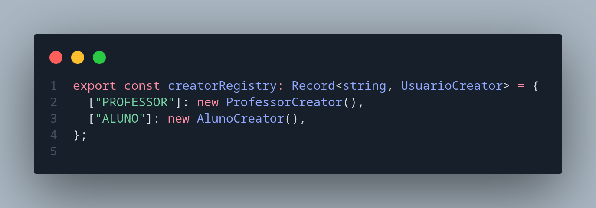

# 3.1. GoFs Criacionais

## Sumário
- [3.1. GoFs Criacionais](#31-gofs-criacionais)
  - [Sumário](#sumário)
  - [Metodologia](#metodologia)
  - [Diagrama antes e depois](#diagrama-antes-e-depois)
  - [Código](#código)
    - [Imagens do builder](#imagens-do-builder)
    - [Imagens do Factory](#imagens-do-factory)
  - [Código rodando](#código-rodando)
  - [Conclusão](#conclusão)
  - [Referências](#referências)
  - [Histórico de Versões](#histórico-de-versões)

---

## Metodologia

Com base nos artefatos previamente produzidos e nos requisitos levantados durante o planejamento da disciplina, foi realizada uma análise dos padrões de projeto GoF criacionais **([Ata de Reunião Nº](http://localhost/))**, com o objetivo de identificar sua aplicabilidade aos componentes da aplicação. Após essa avaliação, o grupo identificou os seguintes padrões e suas respectivas implementações:

- **Factory Method**: Utilizado no processo de registro de usuários, o padrão Factory Method foi adotado para permitir a criação flexível e extensível de diferentes tipos de contas. Essa abordagem facilita a adição de novos papéis ou perfis de usuário no futuro, promovendo um baixo acoplamento e alta coesão na lógica de criação. 
  - [**Implementação - Registrode Usuários**](https://github.com/UnBArqDsw2025-1-Turma01/2025.1-T01-_G7_FCTEPodcast/tree/main/fctepodcast-backend/src/factory/usuario)

- **Builder**: Aplicado na construção de objetos relacionados ao registro de podcasts e episódios, o padrão Builder foi escolhido para lidar com a complexidade da criação dessas entidades, que envolvem campos textuais, verificação de informações e campos de arquivos (Imagens e Áudio), os tornando classes difíceis de serem construidas. O uso desse padrão permite montar objetos passo a passo de maneira mais legível, modular e com menor risco de erros.
  - [**Implementação - PodcastBuilder**](https://github.com/UnBArqDsw2025-1-Turma01/2025.1-T01-_G7_FCTEPodcast/tree/main/fctepodcast-backend/src/builder/Episodio)
  - [**Implementação - EpisodioBuilder**](https://github.com/UnBArqDsw2025-1-Turma01/2025.1-T01-_G7_FCTEPodcast/blob/main/fctepodcast-backend/src/builder/Podcast/PodcastBuilder.ts)
 
- **Singleton**: O padrão Singleton foi empregado para garantir que determinadas classes essenciais da aplicação possuam apenas uma instância ativa durante toda a execução, assegurando consistência e economia de recursos. 
  - [**Implementação - Conexãoco com o Banco de Dados**](https://github.com/UnBArqDsw2025-1-Turma01/2025.1-T01-_G7_FCTEPodcast/tree/main/fctepodcast-backend/src/builder)
  - [**Implementaçao - Sistema de autenticação**](https://github.com/UnBArqDsw2025-1-Turma01/2025.1-T01-_G7_FCTEPodcast/blob/main/fctepodcast-frontend/src/context/auth/AuthContext.tsx)
  - [**Implementação - Sistema de reprodução de áudio**](https://github.com/UnBArqDsw2025-1-Turma01/2025.1-T01-_G7_FCTEPodcast/blob/main/fctepodcast-frontend/src/context/player/PlayerContext.tsx)

A partir dessa análise, os sistemas mencionados foram desenvolvidos seguindo os princípios desses padrões, adaptando suas estruturas às tecnologias utilizadas no projeto: **TypeScript, Express.js e React.js**.

## Diagrama antes e depois

## Código
### Imagens do builder

### Imagens do Factory

## Código rodando

## Conclusão

## Referências

## Histórico de Versões

| Versão |    Data    |        Descrição         |    Autor(es)    |  Revisor(es)     |  Detalhes da Revisão  |  
| :----: | :--------: | :----------------------: | :-------------: | :----------------| :---------------------|
|  1.0   | 31/05/2025 |   Criação do documento   | Natália Rodrigues | Harleny A. | Arquiteura de pastas revisada |
|  1.1   | 31/05/2025 |   Adição de Códigos em imagens   | Gustavo C., Harleny A., Iderlan J., Rafael K. | Gustavo Costa de Jesus | Verificação de inserção de imagens|
| 1.2    | 01/06/2025 | Adição da Metodologia | Gustavo Costa | 