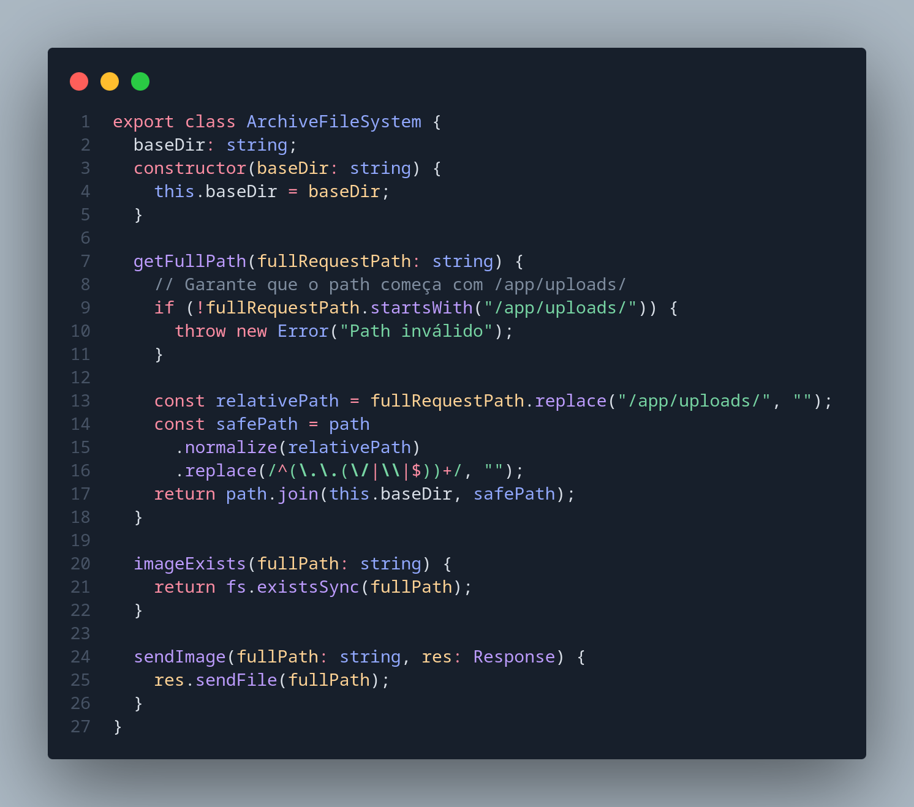

# 3.2. GoFs Estruturais

## Sumário
- [3.2. GoFs Estruturais](#32-gofs-estruturais)
  - [Sumário](#sumário)
  - [Metodologia](#metodologia)
  - [Diagrama antes e depois](#diagrama-antes-e-depois)
    - [Adapter](#adapter)
    - [Facade](#facade)
  - [Código](#código)
  - [Código rodando](#código-rodando)
    - [Facade](#facade-1)
    - [Adapter](#adapter-1)
  - [Conclusão](#conclusão)
  - [Referências](#referências)
  - [Histórico de Versões](#histórico-de-versões)

---

## Metodologia
Com base nos requisitos levantados e nas funcionalidades implementadas, foram analisados os padrões de projeto GoF estruturais, com o objetivo de identificar sua aplicabilidade prática na arquitetura da aplicação ([**Ata Reunião N**](#)). A partir dessa análise, foram adotados os seguintes padrões, conforme descrito e justificado a seguir:

- Adapter: Utilizado na Media API, o padrão Adapter foi empregado para permitir a conversão dos arquivos de mídia armazenados no backend em formatos compatíveis com o frontend. Inicialmente armazenados como arquivos binários, esses dados são convertidos em objetos [**"Blob"**](https://developer.mozilla.org/en-US/docs/Web/API/Blob)  possibilitando seu uso direto na interface da aplicação. Essa adaptação ocorre sem modificar a lógica principal de leitura dos arquivos, promovendo desacoplamento e reutilização de código.
  - [**Implementação - Adapter**](https://github.com/UnBArqDsw2025-1-Turma01/2025.1-T01-_G7_FCTEPodcast/blob/main/fctepodcast-backend/src/adapter/ImageAdapter.ts)

- Facade: O padrão Facade foi aplicado no controle de acesso para fornecer uma interface simples e unificada para um subsistema complexo de autenticação e autorização. Ele abstrai a lógica de criação e validação de tokens JWT e a verificação de permissões, facilitando o uso desses serviços por outras partes da aplicação.
  - [**Implementação - Facade**](https://github.com/UnBArqDsw2025-1-Turma01/2025.1-T01-_G7_FCTEPodcast/blob/main/fctepodcast-backend/src/facade/AuthFacade.ts)
  - [**Implementação - JWTService**](https://github.com/UnBArqDsw2025-1-Turma01/2025.1-T01-_G7_FCTEPodcast/blob/main/fctepodcast-backend/src/services/JWTService.ts)

## Diagrama antes e depois
### Adapter

### Facade

## Código
imagens do adapter

Este código implementa o padrão de projeto Adapter, que é um dos padrões estruturais do GoF. O adaptador implementa a interface ArchiveProvider e utiliza internamente uma instância da classe ArchiveFileSystem.

Ele adapta a interface esperada pelo cliente, que é o método getImage(imagePath, res), para interagir com o sistema de arquivos, verificando se a imagem solicitada existe. Se a imagem existir, o adaptador envia o arquivo como resposta HTTP. Caso contrário, retorna um erro 404.

Além disso, ele trata possíveis erros durante o processo e responde com mensagens JSON apropriadas ao cliente, o que é comum em APIs REST.

Este adaptador está inserido em um contexto real e prático de web backend, com uso de Express e HTTP. Portanto, além de adaptar uma interface, ele também adapta o tratamento de erros para respostas JSON, cumprindo o papel esperado de um adaptador no mundo real.

Esta classe implementa um sistema de arquivos para gerenciar imagens.
Ela é responsável por organizar o local onde as imagens são armazenadas e fornecer métodos para obter o caminho completo de uma imagem, verificar se a imagem existe e enviá-la como resposta HTTP após a conversão para um Blob.

Esta interface define os métodos que um provedor de arquivos de imagem deve implementar.
Ela permite que o sistema funcione com diferentes implementações de provedores, garantindo que todos sigam um contrato comum para obter imagens.
O método getImage recebe o caminho da imagem e o objeto de resposta HTTP para enviar a imagem de volta ao cliente.

Imagens Do Facade

Este código implementa o padrão de projeto Facade, encapsulando a lógica de autenticação e autorização em uma interface simplificada chamada AuthFacade.

O objetivo da fachada é fornecer uma maneira simples de lidar com requisições seguras, escondendo os detalhes de como o token é validado e como o usuário é obtido. A fachada serve como uma interface única para um conjunto complexo de classes.

O principal método exposto é o handleSecureRequest, que recebe uma lista de papéis (roles) permitidos e um handler que será executado apenas se a requisição for autenticada e autorizada corretamente.

A JWTService é responsável por extrair e validar o token JWT da requisição. Já o UsuarioController busca o usuário correspondente ao token. O método verifica a existência do token, sua validade, a existência do usuário, e se o papel do usuário está entre os permitidos.

Além disso, a fachada se adapta ao uso com o framework Express através de middlewares, permitindo integração com rotas seguras. Também permite a injeção de dependências com fallback para instâncias padrão, o que facilita testes com mocks e promove o desacoplamento entre classes.

Este serviço é responsável por lidar com a autenticação baseada em JWT (JSON Web Tokens). Ele extrai o token do cookie da requisição e valida o token usando uma chave secreta. Também lida com erros de validação, retornando null se o token for inválido. É usado pelo AuthFacade para proteger rotas e garantir que apenas usuários autenticados possam acessar recursos protegidos.

## Código rodando

### Facade

A seguir, apresentamos uma demonstração da aplicação do padrão Facade, onde utilizamos um token de aluno para tentar criar um podcast. Devido à ausência de permissões adequadas, o sistema intercepta a requisição e retorna um erro, evidenciando o controle de acesso realizado com sucesso.

<iframe width="560" height="315" src="https://www.youtube.com/embed/kuaR6sFeMVE?si=_7-VWDi2sJYBSDVM" title="YouTube video player" frameborder="0" allow="accelerometer; autoplay; clipboard-write; encrypted-media; gyroscope; picture-in-picture; web-share" referrerpolicy="strict-origin-when-cross-origin" allowfullscreen></iframe>

Também demonstramos, conforme mencionado anteriormente no tópico sobre o padrão [**GoF Criacional - Builder**](/PadroesDeProjeto/3.1.GoFsCriacionais.md?id=metodologia), a integração já implementada com o AuthFacade, responsável por centralizar e gerenciar a lógica de autenticação e autorização dos usuários.

<iframe width="560" height="315" src="https://www.youtube.com/embed/naaPv6M2Ok4?si=I-B56bqxah425S_2" title="YouTube video player" frameborder="0" allow="accelerometer; autoplay; clipboard-write; encrypted-media; gyroscope; picture-in-picture; web-share" referrerpolicy="strict-origin-when-cross-origin" allowfullscreen></iframe>

### Adapter

A demonstração a seguir apresenta a implementação do padrão de projeto Adapter, utilizada para converter imagens em objetos do tipo Blob na API. Essa adaptação permite que os dados sejam transmitidos de forma compatível com o cliente, possibilitando a correta exibição das imagens na interface da aplicação.

<iframe width="560" height="315" src="https://www.youtube.com/embed/IavOaWlG9uc?si=TX4MtuLMerv9SLtF" title="YouTube video player" frameborder="0" allow="accelerometer; autoplay; clipboard-write; encrypted-media; gyroscope; picture-in-picture; web-share" referrerpolicy="strict-origin-when-cross-origin" allowfullscreen></iframe>

## Conclusão

A aplicação prática dos padrões de projeto estruturais da GoF, especificamente Adapter e Facade, demonstrou-se essencial para aprimorar a modularidade, reutilização e manutenibilidade da arquitetura do FCTEPodcast. O uso do padrão Adapter ajudou a garantir um maior desacoplamento entre as camadas do sistema. Já o padrão Facade contribuiu significativamente para a simplificação do processo de autenticação e autorização, unificando e abstraindo operações complexas em uma interface clara e de fácil integração com as rotas protegidas da aplicação.

Além de facilitar a compreensão e manutenção do código, esses padrões promoveram a separação de responsabilidades e possibilitaram maior flexibilidade para futuras alterações ou substituições de componentes. Ademais, a documentação, os diagramas e os trechos de código apresentados reforçam a importância da utilização consciente dos padrões de projeto.

## Referências

## Histórico de Versões

| Versão |    Data    |        Descrição         |    Autor(es)    |  Revisor(es)     |  Detalhes da Revisão  |  
| :----: | :--------: | :----------------------: | :-------------: | :----------------| :---------------------|
|  1.0   | 31/05/2025 |   Criação do documento   | Natália Rodrigues | Harleny A. | Arquiteura de pastas revisada |
|  1.1   | 31/05/2025 |   Adição de Códigos em imagens   | Gustavo C., Harleny A., Iderlan J., Rafael K. | Gustavo Costa de Jesus | Verificação de inserção de imagens|
| 1.2    | 01/06/2025 | Adição da Metodologia | Gustavo Costa | 
| 1.3    | 01/06/2025 | Explicação dos códigos | Natália Rodrigues | 
| 1.4    | 01/06/2025 | Adicionando diagramas | Rafael Kenji |
| 1.5    | 01/06/2025 | Adicionando conclusão | Marcella Anderle | 
| 1.6  | 01/06/2025  | Adição de Vídeos de demonstração | Gustavo C., Rafael K., Iderlan J., Marcella Anderle, Harleny A. |
| 1.7 | 01/06/2025  | Revisão dos textos | Natália Rodrigues, Gustavo Costa, Marcella Anderle |   Gustavo C., Rafael K., Iderlan J., Marcella Anderle, Harleny A. |  Revisão de todos os textos        |  
