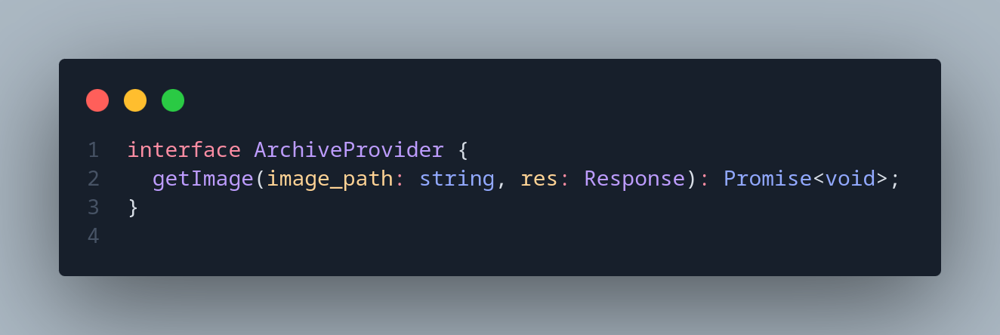

# 3.2. GoFs Estruturais

## Sumário
- [3.2. GoFs Estruturais](#32-gofs-estruturais)
  - [Sumário](#sumário)
  - [Metodologia](#metodologia)
  - [Diagrama antes e depois](#diagrama-antes-e-depois)
  - [Código](#código)
  - [Código rodando](#código-rodando)
  - [Conclusão](#conclusão)
  - [Referências](#referências)
  - [Histórico de Versões](#histórico-de-versões)

---

## Metodologia
Com base nos requisitos levantados e nas funcionalidades implementadas, foram analisados os padrões de projeto GoF estruturais, com o objetivo de identificar sua aplicabilidade prática na arquitetura da aplicação ([**Ata Reunião N**](#)). A partir dessa análise, foram adotados os seguintes padrões, conforme descrito e justificado a seguir:

- Adapter: Utilizado na Media API, o padrão Adapter foi empregado para permitir a conversão dos arquivos de mídia armazenados no backend em formatos compatíveis com o frontend. Inicialmente armazenados como arquivos binários, esses dados são convertidos em objetos [**"Blob"**](https://developer.mozilla.org/en-US/docs/Web/API/Blob)  possibilitando seu uso direto na interface da aplicação. Essa adaptação ocorre sem modificar a lógica principal de leitura dos arquivos, promovendo desacoplamento e reutilização de código.
  - [**Implementação - Adapter**](https://github.com/UnBArqDsw2025-1-Turma01/2025.1-T01-_G7_FCTEPodcast/blob/main/fctepodcast-backend/src/adapter/ImageAdapter.ts)

- Facade: O padrão Facade foi aplicado no controle de acesso para fornecer uma interface simples e unificada para um subsistema complexo de autenticação e autorização. Ele abstrai a lógica de criação e validação de tokens JWT e a verificação de permissões, facilitando o uso desses serviços por outras partes da aplicação.
  - [**Implementação - Facade**](https://github.com/UnBArqDsw2025-1-Turma01/2025.1-T01-_G7_FCTEPodcast/blob/main/fctepodcast-backend/src/facade/AuthFacade.ts)
  - [**Implementação - JWTService**](https://github.com/UnBArqDsw2025-1-Turma01/2025.1-T01-_G7_FCTEPodcast/blob/main/fctepodcast-backend/src/services/JWTService.ts)

## Diagrama antes e depois

## Código
imagens do adapter

Imagens Do Facade

## Código rodando

## Conclusão

## Referências

## Histórico de Versões

| Versão |    Data    |        Descrição         |    Autor(es)    |  Revisor(es)     |  Detalhes da Revisão  |  
| :----: | :--------: | :----------------------: | :-------------: | :----------------| :---------------------|
|  1.0   | 31/05/2025 |   Criação do documento   | Natália Rodrigues | Harleny A. | Arquiteura de pastas revisada |
|  1.1   | 31/05/2025 |   Adição de Códigos em imagens   | Gustavo C., Harleny A., Iderlan J., Rafael K. | Gustavo Costa de Jesus | Verificação de inserção de imagens|
| 1.2    | 01/06/2025 | Adição da Metodologia | Gustavo Costa | 