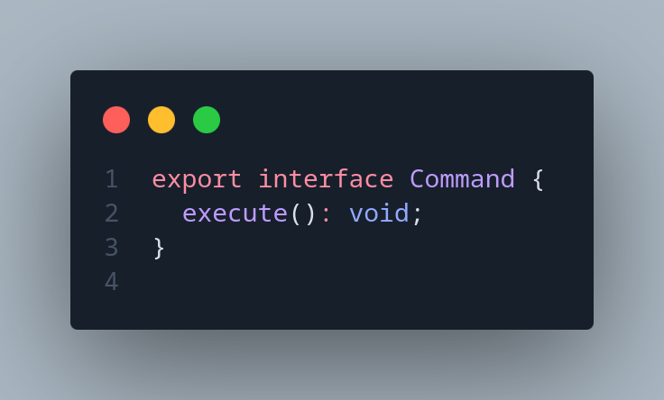
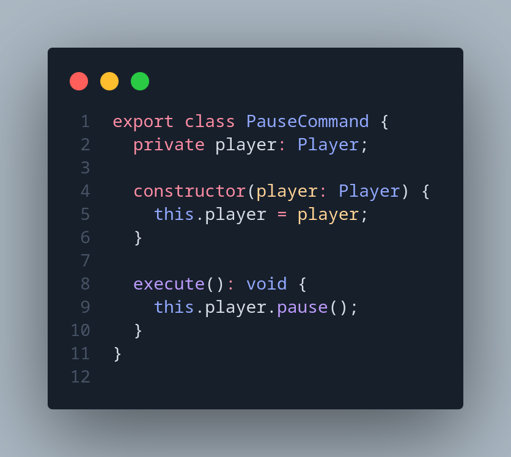
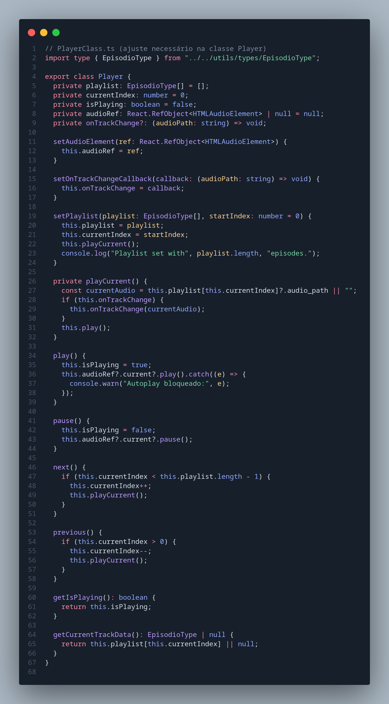
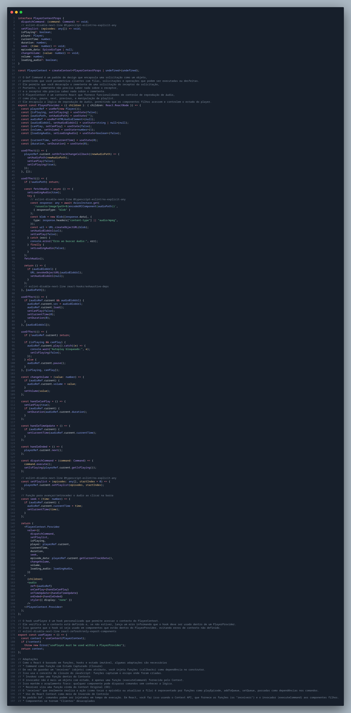

# 3.3. GoFs Comportamentais

## Sumário
- [3.3. GoFs Comportamentais](#33-gofs-comportamentais)
  - [Sumário](#sumário)
  - [Metodologia](#metodologia)
  - [Diagrama antes e depois](#diagrama-antes-e-depois)
  - [Código](#código)
    - [Imagens Código do Command](#imagens-código-do-command)
  - [Código rodando](#código-rodando)
  - [Conclusão](#conclusão)
  - [Referências](#referências)
  - [Histórico de Versões](#histórico-de-versões)

---

## Metodologia
Com base nos requisitos e funcionalidades do projeto, foram analisados os padrões de projeto GoF comportamentais, visando identificar sua aplicabilidade prática na arquitetura da aplicação ([**Ata de Reunião Nº**](#)). A partir dessa análise, o padrão Command foi adotado para o desenvolvimento do player de áudio, conforme descrito e justificado a seguir:

- Command: O padrão Command foi aplicado no player de áudio para encapsular cada ação do usuário (como play, pause, next, previous) em objetos separados que contêm todas as informações necessárias para executar essas operações. Essa abordagem permite tratar comandos como objetos independentes, facilitando o gerenciamento da fila de reprodução, o controle da ordem e o possível suporte a operações de desfazer/refazer.
  - [**Implementação - Player**](https://github.com/UnBArqDsw2025-1-Turma01/2025.1-T01-_G7_FCTEPodcast/tree/main/fctepodcast-frontend/src/context/player)

- Observer: O padrão Observer foi escolhido para o sistema de notificações, visando permitir que múltiplos objetos sejam notificados automaticamente sobre eventos relevantes, como curtidas ou comentários em episódios de podcasts. Essa abordagem estabelece um mecanismo de assinatura em que o professor, enquanto autor do conteúdo, atua como assinante que recebe notificações sempre que um aluno interage com seus episódios. Embora essa funcionalidade ainda não tenha sido implementada, ela será planejada e modelada de acordo com o padrão Observer.

## Diagrama antes e depois

## Código
### Imagens Código do Command

## Código rodando

## Conclusão

## Referências

## Histórico de Versões

| Versão |    Data    |        Descrição         |    Autor(es)    |  Revisor(es)     |  Detalhes da Revisão  |  
| :----: | :--------: | :----------------------: | :-------------: | :----------------| :---------------------|
|  1.0   | 31/05/2025 |   Criação do documento   | Natália Rodrigues | Harleny A. | Arquiteura de pastas revisada |
|  1.1   | 31/05/2025 |   Adição de Códigos em imagens   | Gustavo C., Harleny A., Iderlan J., Rafael K. | Gustavo Costa de Jesus | Verificação de inserção de imagens|
| 1.2    | 01/06/2025 | Adição da Metodologia | Gustavo Costa |
