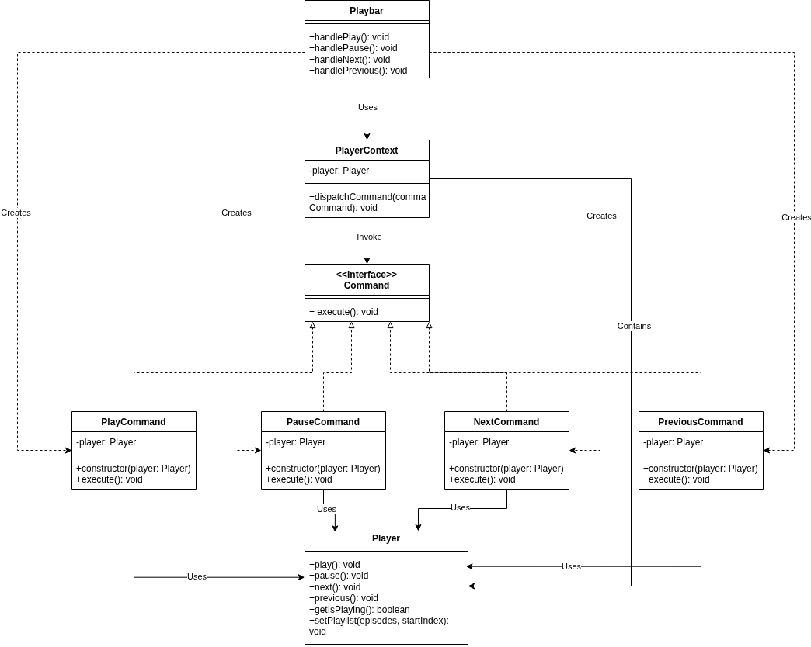

# 3.3. GoFs Comportamentais

## Sumário
- [3.3. GoFs Comportamentais](#33-gofs-comportamentais)
  - [Sumário](#sumário)
  - [Metodologia](#metodologia)
  - [Diagrama antes e depois](#diagrama-antes-e-depois)
    - [Command](#command)
  - [Código](#código)
    - [Imagens Código do Command](#imagens-código-do-command)
  - [Código rodando](#código-rodando)
    - [Command](#command-1)
  - [Conclusão](#conclusão)
  - [Referências](#referências)
  - [Histórico de Versões](#histórico-de-versões)

---

## Metodologia
Com base nos requisitos e funcionalidades do projeto, foram analisados os padrões de projeto GoF comportamentais, visando identificar sua aplicabilidade prática na arquitetura da aplicação ([**Ata de Reunião [28/05]**](https://unbbr-my.sharepoint.com/:w:/g/personal/211062947_aluno_unb_br/EYGy8GTOqkNMpRsLkU-5HDwBDVmftU37wUpjHNnvadjg3g?e=F9YIql)). A partir dessa análise, o padrão Command foi adotado para o desenvolvimento do player de áudio, conforme descrito e justificado a seguir:

- Command: O padrão Command foi aplicado no player de áudio para encapsular cada ação do usuário (como play, pause, next, previous) em objetos separados que contêm todas as informações necessárias para executar essas operações. Essa abordagem permite tratar comandos como objetos independentes, facilitando o gerenciamento da fila de reprodução, o controle da ordem e o possível suporte a operações de desfazer/refazer.
  - [**Implementação - Player**](https://github.com/UnBArqDsw2025-1-Turma01/2025.1-T01-_G7_FCTEPodcast/tree/main/fctepodcast-frontend/src/context/player)

- Observer: O padrão Observer foi escolhido para o sistema de notificações, visando permitir que múltiplos objetos sejam notificados automaticamente sobre eventos relevantes, como curtidas ou comentários em episódios de podcasts. Essa abordagem estabelece um mecanismo de assinatura em que o professor, enquanto autor do conteúdo, atua como assinante que recebe notificações sempre que um aluno interage com seus episódios. Embora essa funcionalidade ainda não tenha sido implementada, ela será planejada e modelada de acordo com o padrão Observer.

Durante as reuniões de equipe realizadas ao longo do desenvolvimento do projeto, que estão devidamente documentadas em atas, discutimos de forma criteriosa sobre o melhor padrão comportamental para utilizarmos em nosso site.

Após uma análise técnica aprofundada dos principais padrões de projeto comportamentais, optamos pela adoção do padrão Command, do catálogo GoF, por apresentar a melhor adequação aos requisitos da aplicação.

-**Command"": Utilizado para implementar as funcionalidades da barra de controle de áudio do site de podcast, como pausar, avançar e retroceder episódios. Permitindo modelar cada requisição como um objeto.

## Diagrama antes e depois
### Command

## Código
### Imagens Código do Command

Esta classe segue a estrutura básica do padrão Command, onde uma operação específica (no caso, pausar) é encapsulada como um objeto independente.

A classe possui um atributo privado player do tipo Player, que é injetado através do construtor. Essa injeção de dependência permite que o comando atue sobre a instância correta do player. O método execute(), obrigatório em implementações do padrão Command, contém a lógica para executar a ação de pausar, simplesmente delegando essa operação para o método pause() do player armazenado.

A classe tem como propósito gerenciar a reprodução de uma sequência de episódios de áudio (playlist), fornecendo:

  - Controle de reprodução (play/pause)

  - Navegação entre faixas (next/previous)

  - Notificação de mudanças de faixa

  - Manutenção do estado atual do player

Esse padrão permite encapsular uma ação (como tocar ou pausar uma faixa) dentro de um objeto, o que facilita passar comandos como parâmetros, registrar listas de ações, e até mesmo desfazer operações. Isso é útil para tornar o player mais flexível e reutilizável.

A lógica central do player está concentrada dentro de um contexto React, chamado PlayerContext, que expõe tanto o estado atual do player quanto as funções de controle. Por meio desse contexto, os componentes filhos conseguem acessar e modificar o que está tocando, o tempo atual da faixa, o volume, entre outras propriedades. Para garantir que esses valores não sejam recriados a cada renderização, alguns elementos como o player de fato são armazenados usando useRef.

Quando um novo caminho de áudio é definido, o player faz o carregamento do arquivo correspondente. Esse processo é tratado de forma assíncrona, e o estado loadingAudio é usado para mostrar visualmente que o carregamento está em andamento.

O código usa useCallback para evitar que funções como playAudio, handleVolumeChange ou handleEnd sejam recriadas desnecessariamente. Essas funções são responsáveis por lidar com ações comuns: iniciar ou pausar o áudio, ajustar o volume, pular para um tempo específico da faixa, ou lidar com o final da reprodução.

Também há um hook chamado usePlayer, que serve como uma maneira prática e segura de acessar o contexto do player dentro de outros componentes. Esse hook lança um erro caso seja usado fora do PlayerProvider, para garantir que ele só funcione dentro do escopo certo.

Adaptamos o padrão Command, já que no React não usamos classes com métodos como em linguagens orientadas a objetos tradicionais. Em vez disso, usamos funções e closures. As ações que seriam métodos de um objeto são passadas como funções diretamente pelo contexto. Os componentes que consomem essas funções acabam se tornando "clientes" do player, usando os comandos de forma desacoplada da implementação interna.

## Código rodando

### Command

A seguir, é apresentada a demonstração da implementação do padrão de projeto Command, já devidamente integrada e funcional na aplicação. Esse padrão foi aplicado no componente de Player de Áudio, permitindo a execução encapsulada dos comandos de play, pause, próximo e anterior.

<iframe width="560" height="315" src="https://www.youtube.com/embed/Ra1PAchKcGI?si=7Ne_CfUSmUaB4dGw" title="YouTube video player" frameborder="0" allow="accelerometer; autoplay; clipboard-write; encrypted-media; gyroscope; picture-in-picture; web-share" referrerpolicy="strict-origin-when-cross-origin" allowfullscreen></iframe>

## Conclusão

A aplicação do padrão Command no player de áudio permitiu organizar de forma clara e flexível as ações do usuário, como tocar, pausar e trocar faixas. Mesmo em um contexto funcional como o React, o padrão foi adaptado com sucesso por meio de contextos e funções reutilizáveis, mantendo os princípios de desacoplamento e coesão. Além disso, o padrão Observer foi escolhido para o futuro sistema de notificações, reforçando uma arquitetura reativa e escalável. 

A adoção dos padrões comportamentais contribuiu diretamente para uma estrutura mais alinhada às boas práticas de desenvolvimento.

## Referências

### 🔧 Padrões Estruturais

- [Refactoring Guru – Design Patterns: Padrões Comportamentais](https://refactoring.guru/design-patterns/behavioral-patterns)  

- [Refactoring Guru – Facade Command](https://refactoring.guru/design-patterns/command)  

### 🎓 Material da Professora
z
- [Material de Apoio - UNB Moodle](https://aprender3.unb.br/mod/page/view.php?id=1372236)  
  Página com material complementar utilizado em sala de aula sobre padrões de projeto.

---

## Histórico de Versões

| Versão |    Data    |        Descrição         |    Autor(es)    |  Revisor(es)     |  Detalhes da Revisão  |  
| :----: | :--------: | :----------------------: | :-------------: | :----------------| :---------------------|
|  1.0   | 31/05/2025 |   Criação do documento   | Natália Rodrigues | Harleny A. | Arquiteura de pastas revisada |
|  1.1   | 31/05/2025 |   Adição de Códigos em imagens   | Gustavo C., Harleny A., Iderlan J., Rafael K. | ---- | -----|
|  1.2   | 01/06/2025 | Adição do conteúdo da seção de metodologia | Marcella Anderle, Gustavo C | Gustavo C. |  Adicionando Elos as funcionalidades implementadas|
|  1.3   | 01/06/2025 | Explicação dos Códigos | Natália Rodrigues | | |
|  1.4   | 01/06/2025 | Adicionando diagramas | Rafael Kenji | | |
|  1.5   | 01/06/2025 | Adicionando conclusão | Marcella Anderle | | |
| 1.6  | 01/06/2025  | Adição de Vídeos de demonstração | Gustavo C., Rafael K., Iderlan J., Marcella Anderle, Harleny A. |
| 1.7  | 01/06/2025  | Revisão dos textos | Natália Rodrigues, Gustavo Costa, Marcella Anderle|   Gustavo C., Rafael K., Iderlan J., Marcella Anderle, Harleny A. |  Revisão de todos os textos        | 
|1.8|	02/06/2025	|Adição de Referências| Harleny Angéllica|	Gustavo Costa|Texto Revisado |