# 3.5. Iniciativas Extras (Padrões de Projeto)

## Acessibilidade no Projeto

Como iniciativa extra, decidimos adicionar recursos de acessibilidade ao nosso projeto, tornando-o mais inclusivo e alinhado às boas práticas da web. 

Implementamos atributos como `aria-label`, `role` e `alt` em pontos estratégicos da interface, com o objetivo de melhorar a navegação para usuários que utilizam leitores de tela. 

A seguir, destacamos alguns trechos do código onde essas 
melhorias foram aplicadas.

---

## Acessibilidade na Tela Home

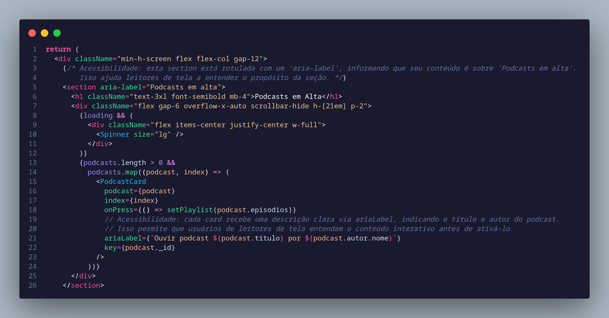

No trecho deste código, foi utilizado o atributo `aria-label` em uma `<section>` para informar que seu conteúdo é sobre **"Podcasts em alta"**.  
Essa prática melhora a **acessibilidade**, pois ajuda **leitores de tela** a entenderem o propósito da seção, mesmo **sem um título visível**.

O atributo `aria-label` define uma **descrição textual** que rotula o elemento HTML ao qual está aplicado.  
Ele é especialmente útil quando o elemento **não possui um texto visível**, permitindo que **tecnologias assistivas**, como leitores de tela, anunciem corretamente seu propósito.
 
 ---

## Acessibilidade nos Cards de Autores

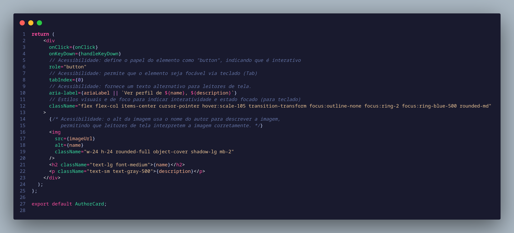

No trecho deste código, foram aplicadas boas práticas para garantir que um elemento visualmente personalizado (como uma `
` com comportamento de botão) seja acessível para todos os usuários, incluindo aqueles que utilizam leitores de tela ou navegam apenas com o teclado.

### Detalhes das Acessibilidades Aplicadas

- **`role="button"`**  
  Informa aos leitores de tela que o elemento atua como um botão, mesmo que seja uma `
` em vez de um elemento `<button>` nativo.

- **`tabIndex={0}`**  
  Torna o elemento focável via teclado, permitindo que ele seja acessado com a tecla Tab. Isso é essencial para a navegação sem mouse.

- **Evento `onKeyDown` com as teclas Enter e Espaço**  
  Garante que o botão possa ser ativado por teclado, simulando o comportamento padrão de botões, como esperado por usuários de tecnologias assistivas.

- **`alt` na imagem**  
  Descreve o conteúdo da imagem, permitindo que usuários com deficiência visual compreendam o contexto visual.

- **Estilos visíveis de foco (`focus:ring`)**  
  Aplica um destaque visual quando o elemento está em foco, o que melhora a experiência de navegação por teclado e reforça a usabilidade.

---

## Acessibilidade em Campos de Formulário

 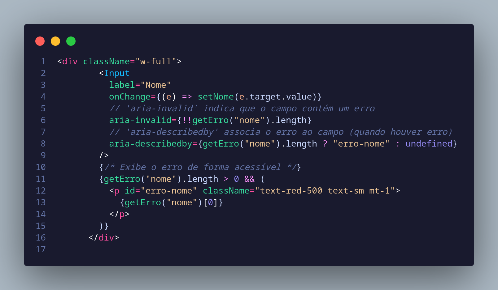

No trecho deste código, foram aplicadas boas práticas para garantir que campos de entrada personalizados sejam acessíveis para todos os usuários, incluindo aqueles que utilizam leitores de tela ou navegam apenas com o teclado.

### Detalhes das Acessibilidades Aplicadas

- **`aria-invalid`**  
  Informa aos leitores de tela que o campo está com um valor inválido, permitindo que o usuário compreenda imediatamente que há um erro associado ao campo.

- **`aria-describedby`**  
  Associa a mensagem de erro (renderizada abaixo do campo) ao campo de entrada, garantindo que tecnologias assistivas anunciem a explicação do erro de forma clara e contextual.

- **Mensagem de erro visível com `id`**  
  A mensagem de erro é exibida visualmente com um identificador (`id`) usado pelo `aria-describedby`, garantindo acessibilidade tanto para usuários videntes quanto para leitores de tela.

### Melhoria do Diagrama UML

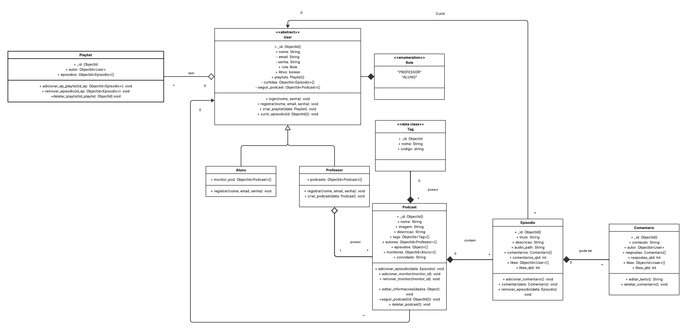

Nessa nova versão o diagrama UML foi ajustado para melhorar a clareza e refletir com mais precisão as regras de negócio do sistema de podcasts. As associações entre as classes foram revisadas. Métodos como adicionar_episodio e adicionar_comentario foram posicionados em classes específicas, alinhados com as suas responsabilidades. Além disso, detalhes como a cardinalidade das associações e os atributos de identificação e funcionalidade de cada entidade foram refinados, garantindo uma representação mais 
fiel dos requisitos do projeto.

### Diagrama de Comunicação

 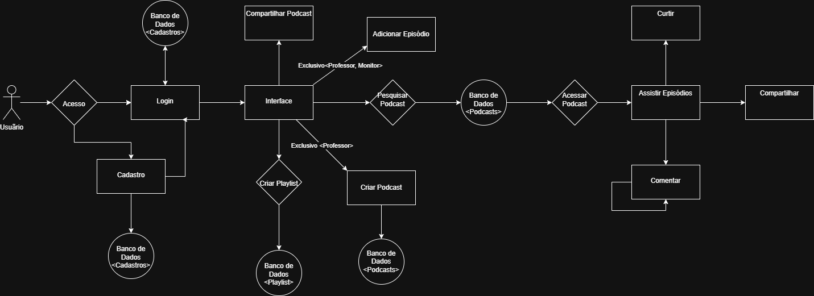

O diagrama de comunicação descreve as interações entre objetos ou entidades do sistema em um cenário específico, focando nas mensagens trocadas e na sequência de eventos. Ele mostra como o usuário interage com o sistema, seleciona um podcast, acessa um episódio e adiciona um comentário, com cada passo numerado para indicar a ordem das operações.

---
## Reformulação do Protótipo com Foco em Acessibilidade e Identidade Visual

Como iniciativa extra desta entrega, reformulamos a identidade visual do nosso protótipo no Figma para garantir mais consistência, clareza e acessibilidade.

Adotamos uma nova paleta de cores com melhor contraste, seguindo boas práticas de design acessível para atender pessoas com baixa visão ou sensibilidade a cores. Além disso, organizamos e documentamos detalhadamente todos os componentes presentes nas telas, o que facilita a implementação e garante maior coerência entre o design e o código.

Essa reformulação reforça nosso compromisso com a inclusão digital, garantindo que o sistema seja não apenas visualmente agradável, mas também utilizável por todos os públicos.

 A seguir, ilustramos alguns dos principais componentes definidos no Figma.

###  Exemplos de Componentes do Protótipo

#### Podcast

O componente **Podcast** é uma unidade visual completa e interativa que representa um episódio de podcast.  
Ele apresenta informações estruturadas, controles de mídia e descrição do conteúdo, com foco em usabilidade e acessibilidade.

#### Monitor

O componente **Monitor** é um bloco visual que representa um elemento de destaque, utilizado para apresentar conteúdo multimídia (como vídeo ou visualização de podcast).  
Ele é projetado de forma simples e centrada, com foco em clareza e acessibilidade.

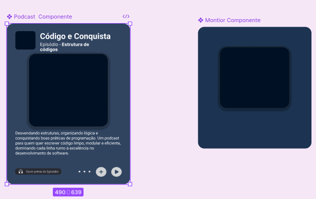

#### Player 

O **Componente Play** é um organismo reutilizável dentro do **Podcast** e em todas outras seções do nosso site.

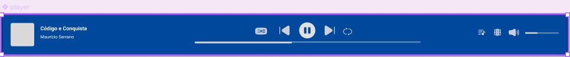

#### Home

A **Home** é a tela principal da aplicação, projetada para oferecer uma experiência personalizada e intuitiva ao usuário.  
Seu escopo abrange a apresentação dos principais conteúdos, facilitando o acesso rápido a diferentes tipos de mídia e informações relevantes.

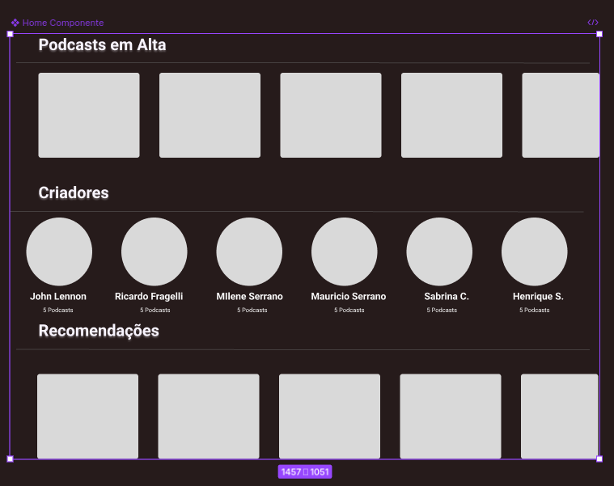

---
### Atomic Design: do Protótipo à Implementação

Desde o início do projeto, adotamos o Atomic Design como metodologia para a construção dos componentes no Figma. Essa abordagem modular foi mantida também na implementação da interface.

🔹 A estrutura do design seguiu os níveis do Atomic Design:

- Atoms: botões, ícones, campos de entrada;
- Molecules: formulários, cards, blocos informativos;
- Organisms: seções completas como listas de episódios ou áreas de navegação.

Ao manter essa organização na implementação, conseguimos:

- Reutilização eficiente de código;
- Clareza na separação de responsabilidades;
- Testes mais granulares e reutilizáveis;
- Melhor manutenção e escalabilidade do projeto.

---

###  Tela Home Final (Após Reformulação)

Abaixo, a versão final da tela Home, após a aplicação da nova identidade visual e dos princípios de acessibilidade e design atômico:

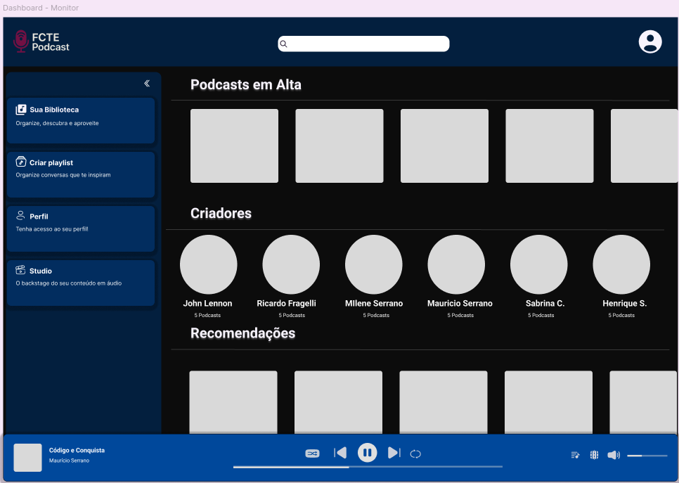

Nesta página, o usuário com perfil de Monitor pode facilmente adicionar novos episódios à plataforma. A interface foi projetada para ser simples, direta e acessível, garantindo um fluxo eficiente de publicação de conteúdos.

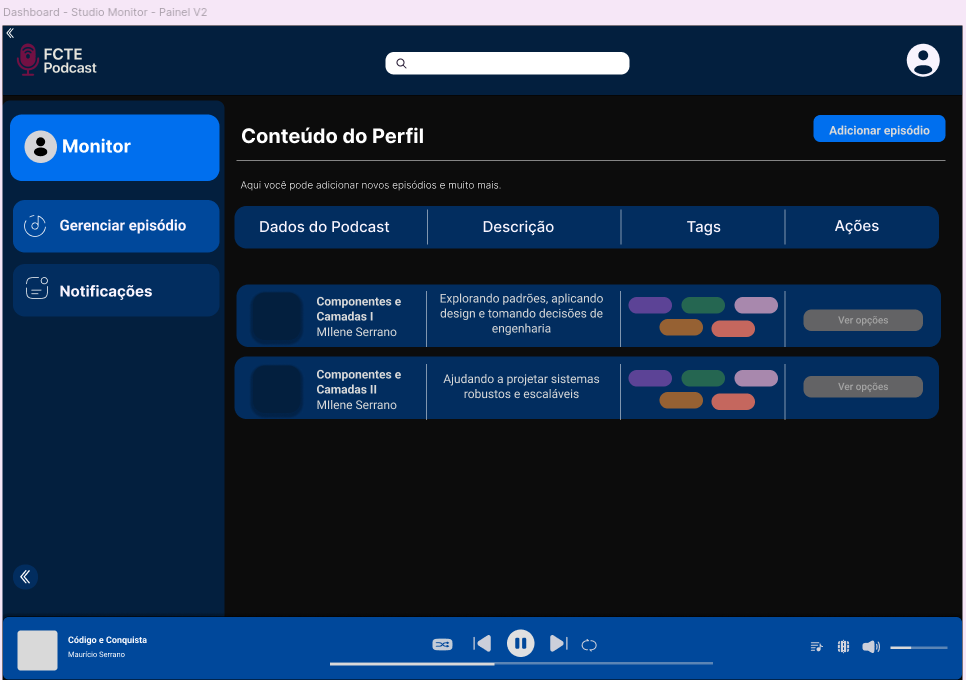

Aqui, o Monitor pode acompanhar todas as notificações recebidas ao longo do tempo. 

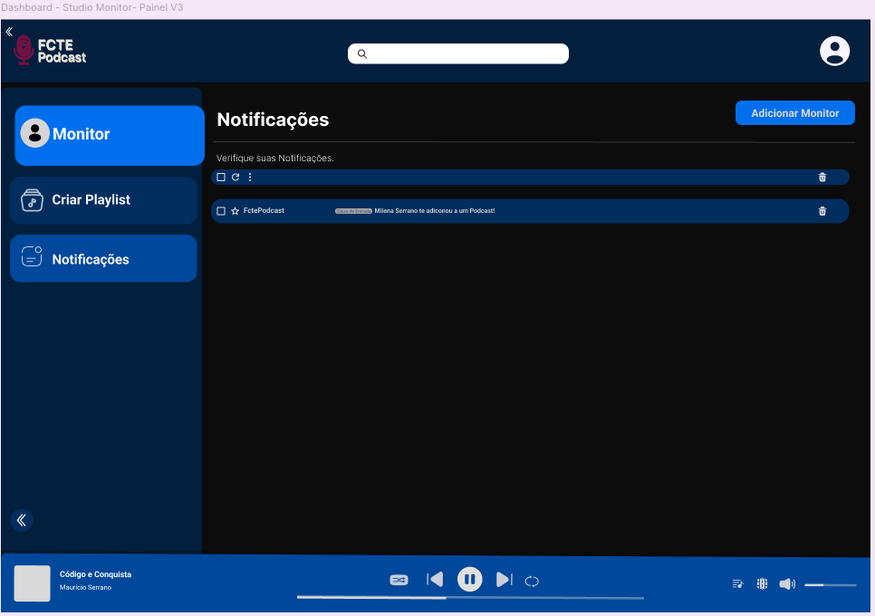

---
  ### Link para o protótipo no Figma

  Acesse o protótipo completo no Figma clicando no link abaixo:

  [Figma - Protótipo FCTEPodcast](https://www.figma.com/design/HRqVTNpsnxofrXHH26s3DT/FCTEPodcast?node-id=67-804&p=f&t=FhaKXdbphgMxPzvh-0)

---

## Referências

**VerificAAA*: Disponível em:
<https://vitorfleonardo.github.io/VerificaAAA/>. Acesso em: 20 de maio. 2025.

**MDN Web Docs.** *ARIA: aria-label*. Disponível em: <https://developer.mozilla.org/pt-BR/docs/Web/Accessibility/ARIA/Reference/Attributes/aria-label>. Acesso em: 1 jun. 2025.

**W3C.** *Techniques for WCAG 2.0: Using ARIA*. Disponível em: <https://www.w3.org/TR/WCAG20-TECHS/aria#ARIA7>. Acesso em: 1 jun. 2025.

**Aditus.** *aria-label – exemplos e boas práticas*. Disponível em: <https://www.aditus.io/aria/aria-label/>. Acesso em: 1 jun. 2025.

| Versão |    Data    |        Descrição         |    Autor(es)    |  Revisor(es)     |  Detalhes da Revisão  |  
| :----: | :--------: | :----------------------: | :-------------: | :----------------| :---------------------|
|  1.0   | 31/05/2025 |   Criação do documento   | Natália Rodrigues | Harleny A.     |Adição de versionamento|
|  1.1   | 01/06/2025 |   Adição de Acessibilidade no Código   | Iderlan J. | Harleny A.    | Rexto revisado|
|  1.2   | 01/06/2025 |   Adição de Diagramas extras   | João Paulo B. |  Harleny A.   | Caminho de diagrama revisado|
|  1.3   | 01/06/2025 |   Adição de Protótipo do Figma  | Harleny A., Iderlan J. |  Gustavo C.  | Texto Revisado|