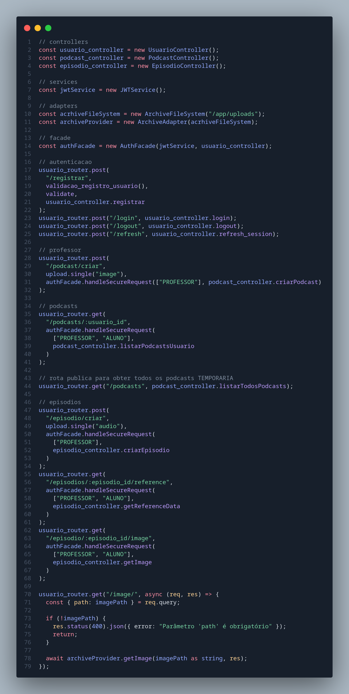
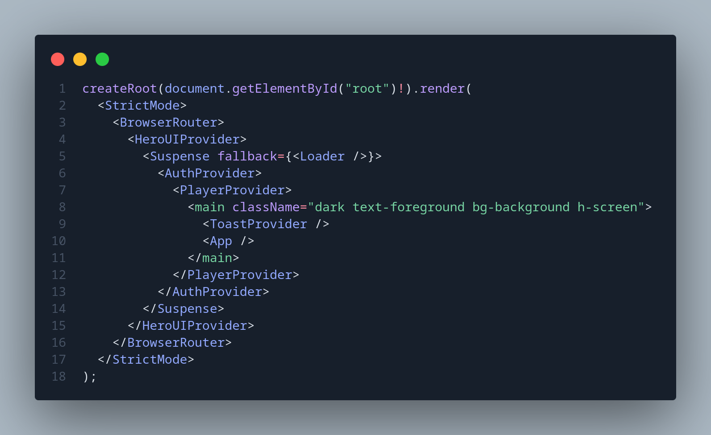

# 3.6. Detalhes Técnicos

Esta seção tem como objetivo esclarecer alguns pontos específicos da implementação que não foram abordados com profundidade anteriormente, por se tratarem de particularidades do framework utilizado. A imagem a seguir ilustra o processo de instanciação das classes e componentes empregados na aplicação dos padrões de projeto (GoF) desenvolvidos pelo grupo.

### API

Na imagem abaixo, é possível visualizar como os padrões de projeto (GoFs) e os controllers foram instanciados na API. Algumas adaptações foram necessárias, uma vez que o ExpressJS exige que as rotas sejam definidas por meio de funções que recebem objetos de requisição e resposta como parâmetros. Por esse motivo, foi preciso ajustar a estrutura dos padrões para integrá-los adequadamente às rotas da aplicação.

### FrontEnd

Com a imagem abaixo, demonstramos como é realizada a instanciação dos Singletons no frontend. Como mencionado anteriormente, devido às características do framework React, não utilizamos classes diretamente. Em vez disso, a instanciação é feita por meio da Context API do React. Os Singletons são implementados por meio de providers (como AuthProvider e PlayerProvider), o que garante que apenas uma única instância seja mantida durante o ciclo de vida da aplicação e que essa instância esteja acessível globalmente a todos os componentes que dela necessitem.

## Referências

## Histórico de Versões

| Versão |    Data    |        Descrição         |    Autor(es)    |  Revisor(es)     |  Detalhes da Revisão  |  
| :----: | :--------: | :----------------------: | :-------------: | :----------------| :---------------------|
|  1.0   | 31/05/2025 |   Criação do documento   | Harleny A.  | --- | --- |
|  1.1   | 02/06/2025 |   Adição de explicações sobre como ocorre as instanciações | Gustavo C. | --- | --- |